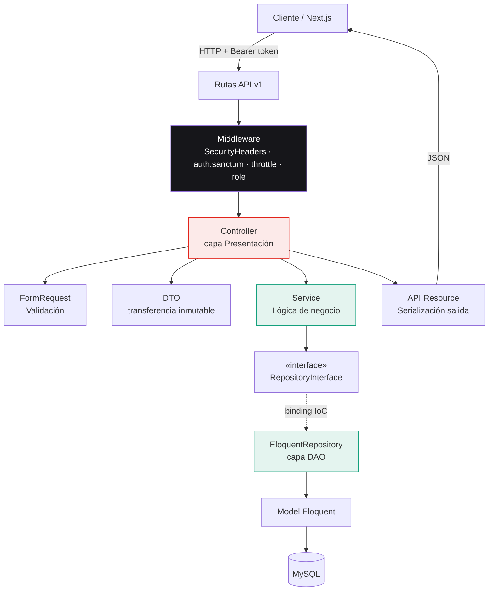
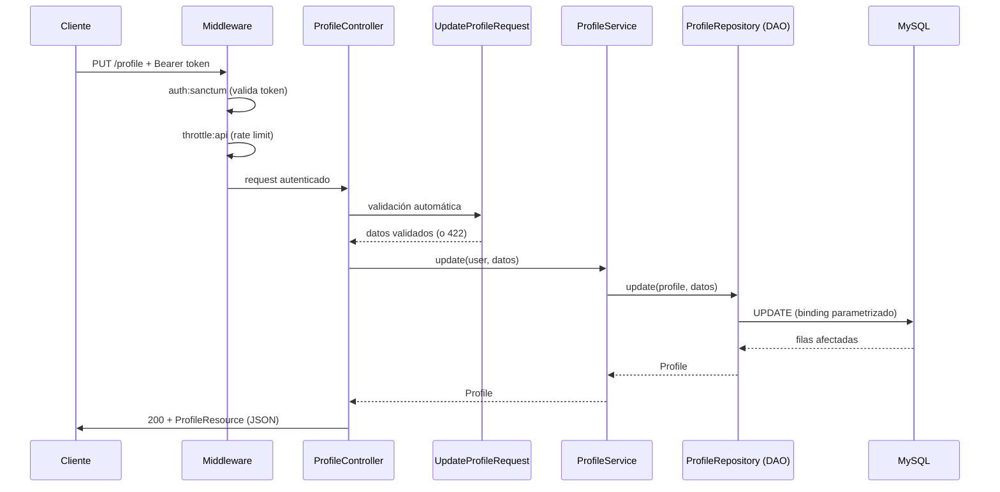
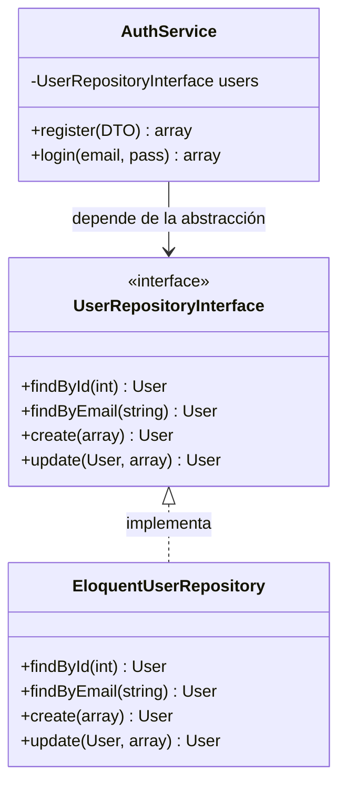
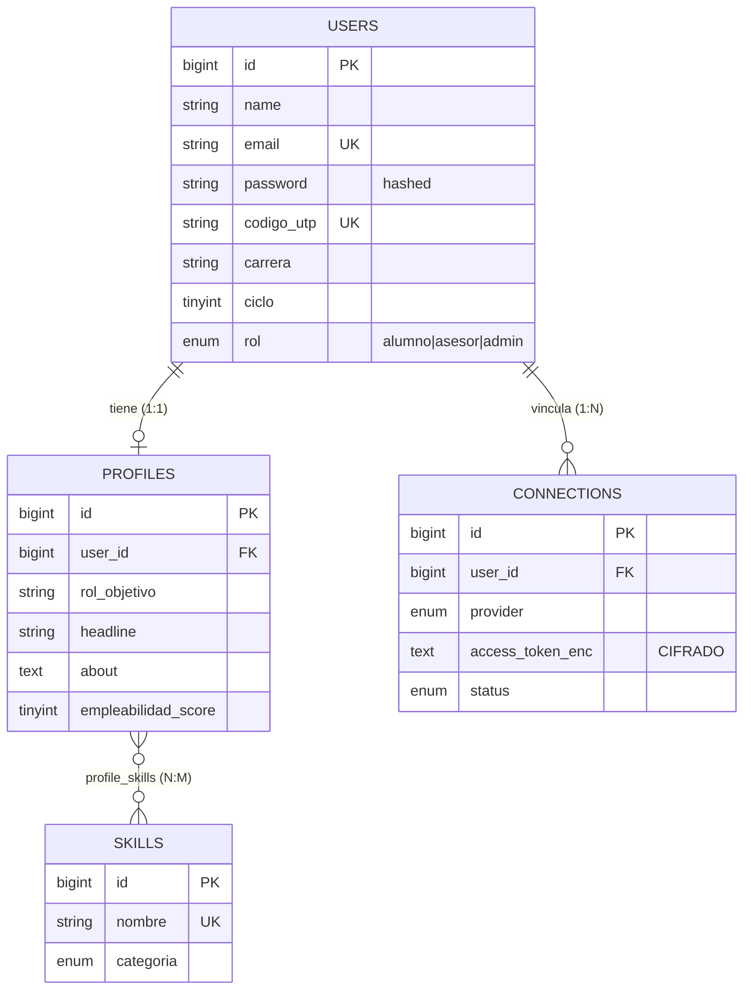

# Arquitectura — UTP+Match API

> Backend del copiloto de empleabilidad UTP+Match.
> **Stack:** Laravel 12 · PHP 8.2 · MySQL · Sanctum (Bearer tokens).
> **Estilo:** API REST por capas — **MVC + DAO/Repository + Service + DTO**.

---

## 1. Visión general

La API sigue una **arquitectura en capas** con separación estricta de responsabilidades.
Cada petición atraviesa las capas en un solo sentido; **ninguna capa salta a otra que no sea su vecina inmediata**.

---

## 2. Responsabilidad de cada capa

| Capa | Carpeta | Responsabilidad | Regla de oro |
|------|---------|-----------------|--------------|
| **Rutas** | `routes/api.php` | Mapear URL → Controller, aplicar middleware | Versionadas `/api/v1` |
| **Middleware** | `app/Http/Middleware` | Seguridad transversal (headers, auth, rate limit, RBAC) | Falla cerrado |
| **Controller** | `app/Http/Controllers/Api/V1` | Traducir HTTP ↔ dominio. **Sin lógica de negocio** | Delgado (SRP) |
| **FormRequest** | `app/Http/Requests` | Validar y normalizar la entrada | Lista blanca de campos |
| **DTO** | `app/DataTransferObjects` | Transportar datos validados entre capas | Inmutable (`readonly`) |
| **Service** | `app/Services` | **Lógica de negocio** y orquestación | No conoce HTTP |
| **Repository (DAO)** | `app/Repositories` | Único punto de acceso a datos | Detrás de una interfaz |
| **Model** | `app/Models` | Mapeo objeto-relacional (Eloquent) | Relaciones + casts |
| **Resource** | `app/Http/Resources` | Serializar la salida (lista blanca) | Nunca expone secretos |

---

## 3. Flujo de un request autenticado (secuencia)

Ejemplo: `PUT /api/v1/profile` (actualizar Perfil 360).

---

## 4. Patrón Repository / DAO + Inversión de Dependencias

El núcleo de la testabilidad y el desacople:

- `AuthService` **depende de la interfaz**, no de Eloquent (principio **DIP** de SOLID).
- El binding interfaz→implementación vive en `RepositoryServiceProvider`.
- Para pruebas, se puede cambiar el binding por un *fake* sin tocar la lógica (**OCP**).

---

## 5. Modelo de datos (ER) — módulo Auth + Perfil 360

---

## 6. Principios SOLID aplicados

| Principio | Dónde se ve |
|-----------|-------------|
| **S** — Responsabilidad única | Controller traduce HTTP, Service razona, Repository accede a datos |
| **O** — Abierto/cerrado | Cambiar de almacenamiento = cambiar el binding, no la lógica |
| **L** — Sustitución de Liskov | Cualquier `*RepositoryInterface` es intercambiable |
| **I** — Segregación de interfaces | Interfaces pequeñas y específicas por entidad |
| **D** — Inversión de dependencias | Services dependen de interfaces, no de implementaciones |

---

## 7. Convenciones

- **Versionado:** todo bajo `/api/v1`. Cambios incompatibles → `/api/v2`.
- **Respuesta uniforme:** `{ "data": ..., "message": ... }` y `{ "message", "errors" }` en error.
- **Códigos HTTP correctos:** 200, 201, 401, 403, 422, 429.
- **Nombres en español** en el dominio (campos, mensajes), inglés en el framework.

Ver también: [`SECURITY.md`](./SECURITY.md) · [`../README.md`](../README.md)
