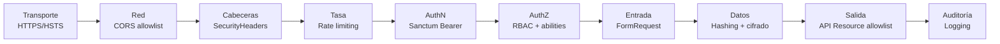

# Ciberseguridad — UTP+Match API

> Controles de seguridad implementados, mapeados al **OWASP Top 10 (2021)**.
> Enfoque: **defensa en profundidad** y **fallar cerrado** (deny by default).

---

## 1. Resumen por capas de defensa



Una petición maliciosa debe superar **todas** las capas; cada una mitiga un riesgo distinto.

---

## 2. Mapa OWASP Top 10 → control implementado

| # | Riesgo OWASP 2021 | Control en UTP+Match | Dónde |
|---|-------------------|----------------------|-------|
| **A01** | Broken Access Control | RBAC (`role` middleware) · operaciones siempre sobre `request->user()` (anti-IDOR) · abilities por token · `$hidden`/Resources | `EnsureUserHasRole`, `ProfileService`, `UserResource` |
| **A02** | Cryptographic Failures | Password `bcrypt` (cast `hashed`) · tokens OAuth **cifrados** (cast `encrypted`, AES-256) · HSTS | `User`, `Connection`, `SecurityHeaders` |
| **A03** | Injection | Eloquent/Query Builder con **binding parametrizado** · validación de entrada · CSP | Repositorios, FormRequests |
| **A04** | Insecure Design | Arquitectura por capas · DTO inmutable · privilegio mínimo en abilities | Toda la app |
| **A05** | Security Misconfiguration | Cabeceras endurecidas · CORS allowlist (no `*`) · errores JSON sin stack trace · `APP_DEBUG=false` en prod | `SecurityHeaders`, `config/cors.php`, `bootstrap/app.php` |
| **A06** | Vulnerable Components | Dependencias mínimas · `composer audit` · Laravel 12 LTS | `composer.json` |
| **A07** | Auth & Identification Failures | Política de contraseña fuerte + `uncompromised()` · rate limit de login (5/min) · mensaje genérico anti-enumeración · expiración de token | `RegisterRequest`, `AuthService`, `throttle:auth` |
| **A08** | Software & Data Integrity | Mass-assignment controlado (`$fillable` sin `rol`) · DTO valida forma | `User`, DTOs |
| **A09** | Logging & Monitoring Failures | Log de eventos de auth (login OK/KO, registro, logout) | `AuthService` |
| **A10** | SSRF | (Cuando se integren APIs externas) lista blanca de hosts + timeouts | *pendiente módulo Empleos* |

---

## 3. Detalle de controles clave

### 3.1 Autenticación (Sanctum, Bearer token)
- Tokens **personales** (no cookies de sesión) → el frontend usa `Authorization: Bearer`.
- **No se activa `statefulApi()`** a propósito: evitaría CSRF/419 desde orígenes cruzados.
- Expiración configurable (`SANCTUM_TOKEN_EXPIRATION`, 24h por defecto).
- `logout` **revoca solo el token actual** (no afecta otros dispositivos).

### 3.2 Contraseñas (A02/A07)
```php
Password::min(8)->mixedCase()->numbers()->symbols()->uncompromised()
```
- Hash **bcrypt** automático vía cast `'hashed'`.
- `uncompromised()` consulta el dataset de filtraciones por **k-anonymity** (no envía la clave).

### 3.3 Cifrado de tokens de terceros (A02)
Los `access_token` de LinkedIn/GitHub se guardan con cast `'encrypted'`:
- En BD quedan **ilegibles** (AES-256-CBC con `APP_KEY`).
- Están en `$hidden` → **nunca** salen en JSON.

### 3.4 Control de acceso (A01)
- **Autenticación** (`auth:sanctum`) + **Autorización** (`role:`) son pasos separados.
- Las operaciones de perfil usan `$request->user()` y **no aceptan IDs de la URL** → previene IDOR.
- `rol` **no es mass-assignable** → no se puede escalar privilegios por payload.

### 3.5 Rate limiting (A07)
| Limiter | Límite | Uso |
|---------|--------|-----|
| `throttle:auth` | 5 req/min por IP | login, registro |
| `throttle:api`  | 60 req/min por usuario · 30 por IP | resto de la API |

Excederlo → **429 Too Many Requests**.

### 3.6 Cabeceras de seguridad (A05)
`X-Content-Type-Options`, `X-Frame-Options: DENY`, `Referrer-Policy`,
`Permissions-Policy`, `Content-Security-Policy`, `HSTS` (en HTTPS).
Se eliminan `X-Powered-By` y `Server` (anti-fingerprinting).

### 3.7 Manejo de errores (A05/A09)
- Respuestas **siempre JSON** para `api/*`.
- **Nunca** se filtra stack trace al cliente (`APP_DEBUG=false` en producción).
- Contrato uniforme: `{ "message", "errors" }`.

---

## 4. Checklist de despliegue seguro

- [ ] `APP_DEBUG=false` y `APP_ENV=production`
- [ ] `APP_KEY` generada y secreta (rota si se filtra)
- [ ] `CORS_ALLOWED_ORIGINS` con el dominio real (sin `*`)
- [ ] HTTPS forzado (HSTS ya configurado)
- [ ] Credenciales de BD y `CLAUDE_API_KEY` solo en `.env` (nunca en git)
- [ ] `composer audit` sin vulnerabilidades
- [ ] Backups de BD y rotación de logs
- [ ] Rate limits revisados para carga real

---

## 5. Evidencia de funcionamiento (pruebas manuales)

| Caso | Esperado | Resultado |
|------|----------|-----------|
| Registro con datos válidos | 201 + token | ✅ |
| Login correcto | 200 + token + `rol: alumno` | ✅ |
| Acceso a `/me` sin token | 401 "No autenticado" | ✅ |
| Registro con password débil | 422 con errores | ✅ |
| Cabeceras de seguridad presentes | nosniff, DENY, CSP… | ✅ |

Ver también: [`ARCHITECTURE.md`](./ARCHITECTURE.md)
